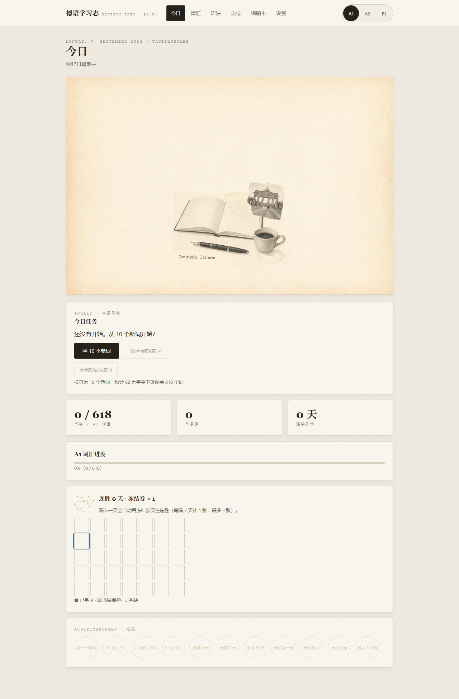
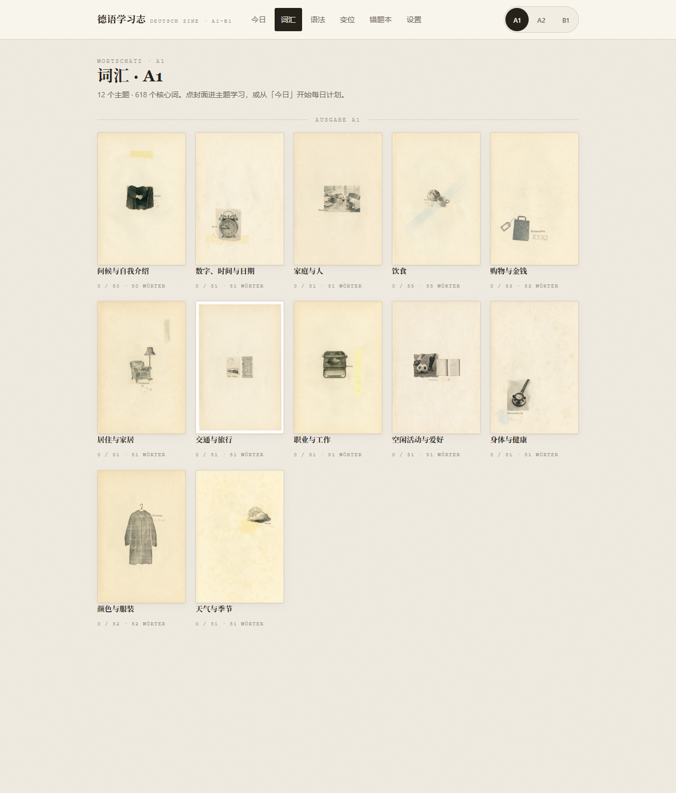
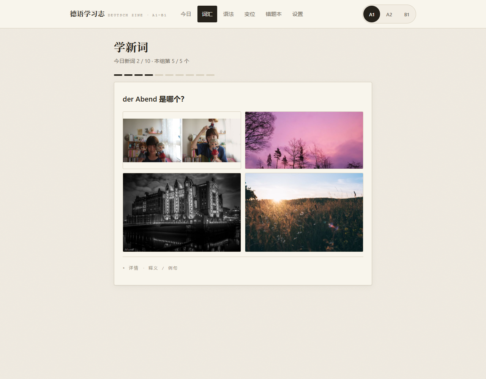
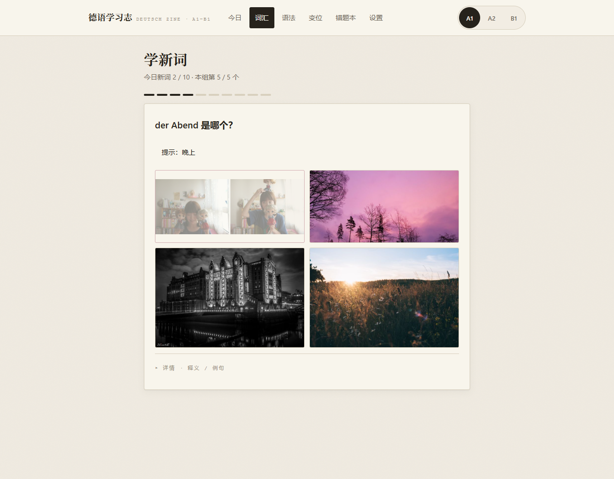
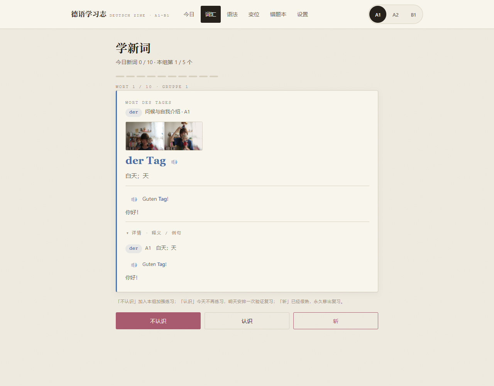
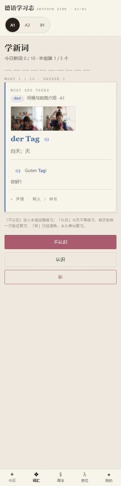

# 德语学习志 · Deutsch Zine

<p>
  
</p>

面向中文母语者的德语自学应用，覆盖 **A1 → B1**。纯静态网页，双击 `index.html` 即用；学习数据只存在你自己的浏览器里，零服务器、零账号。

## 为什么是「杂志」

语言学习需要的是一个愿意每天打开的环境。全站采用 muted zine 纸感设计：米色旧纸底、衬线刊头、打字机微文本、装饰金线——像翻一本德语小杂志，而不是刷一张表格。

## 学习系统（参考百词斩，并由遗忘曲线驱动）

- **图片四选一**：看图识词是核心题型，图文直接建立记忆钩子（833 张逐张视觉审核过的配图；无图词自动回退文字题）
- **三按钮分流**：介绍每个词时选「不认识 / 认识 / 斩」——认识的词进一次验证复习，答对即「斩」；斩掉的词永久移出复习
- **渐进式提示**：答得错得多，提示给得多——图片题：释义 → 排除至二选一 → 高亮答案；选择题：词性+首字母 → 揭示；拼写：首字母 → 半词 → 完整答案
- **错词反复出现**：答错的词当次隔 3 题再来，直到答对（每词上限 2 轮）
- **FSRS 遗忘曲线复习**：Anki 同款 FSRS-4.5 算法；复习队列按可提取度升序，最容易忘的优先；待验证卡与错词插队
- **单词详情抽屉**：任意词卡可展开释义、例句（含朗读），动词附现在时六人称变位小表
- **每日节奏**：「今日新词 x/N」进度可见，设置页 5–30 词可调，今日页显示预计学完天数

## 内容规模

| 维度 | 数量 |
|---|---|
| 词汇 | 1945 词（A1 618 / A2 612 / B1 715），38 个主题 |
| 语法 | 36 个专题（讲解 + 交互练习），错题纳入 FSRS |
| 音频 | 1945 词 + 1945 例句 + 251 变位形式，全部预生成 mp3（神经语音） |
| 图片 | 833 张词条配图（全部经视觉审核）+ 38 张 Seedream 生成的 zine 风主题封面 |
| 其他 | 动词变位查询、错题本、连胜日历、成就徽章、移动端底部导航 |

## 界面

<p>
  
  
</p>
<p>
  
  
</p>
<p>
  
  
</p>

## 快速开始

```bash
# 方式一：直接双击 index.html（纯静态，无需构建）
# 方式二：起本地服务（推荐，移动端同局域网可访问）
python -m http.server 8765
# 打开 http://localhost:8765
```

## 开发

```bash
npm install         # 仅 esbuild 一个构建依赖
npm run dev         # watch 模式：src/ → js/bundle.js
npm test            # 57 项单元测试（FSRS、判分、斩机制、图片选题、数据完整性）
npm run build       # 生产构建（IIFE + ES2018 + sourcemap + minify）
```

技术栈：原生 HTML/CSS/JS（ESM → esbuild 单文件 IIFE），Hash 路由，IndexedDB 主存 + localStorage 镜像。零框架、零运行时依赖。

```
data/     内容数据（按级别分文件，懒加载）
src/      ESM 源码（构建入口 src/main.js）
audio/    预生成 mp3（edge-tts Katja 神经语音）
images/   配图与封面（credits.json 记录每张图的授权信息）
tools/    内容生产管道（音频/配图/封面生成，详见 tools/README.md）
```

## 内容来源与授权

- **词条配图**：[Wikimedia Commons](https://commons.wikimedia.org/) 与 [Openverse](https://api.openverse.org/) 的免费授权图片（CC 系列/公有领域），逐张授权信息见 `images/credits.json`；全部经过逐张视觉相关性审核，错配图已移除
- **主题封面与装饰插画**：由 Seedream 5.0 pro 生成的 zine 纸感风格图
- **语音**：edge-tts 神经语音预生成（个人学习用途；如二次分发请重新评估语音授权）
- **词汇/语法内容**：项目自编，参照 CEFR A1–B1 大纲

## 文档

| 文档 | 内容 |
|---|---|
| `DESIGN.md` | UI/UX 设计规范（muted zine 令牌、词性三色、动效底线） |
| `AGENTS.md` | 项目约定：目录结构、数据格式、命名约定、内容生产 SOP |
| `CHANGELOG.md` | 版本历史（Keep a Changelog） |
| `docs/技术调研与开发规划.md` | 竞品调研、架构演进、路线图 |
| `docs/superpowers/` | S5 学习系统设计规格与实施计划 |

## License

代码 MIT。内容资源（图片/音频）各随其源授权，见 `images/credits.json`；edge-tts 语音请在二次分发前自行评估。
