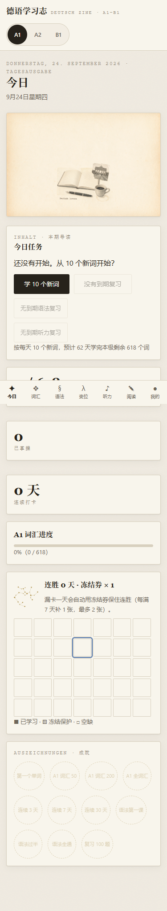
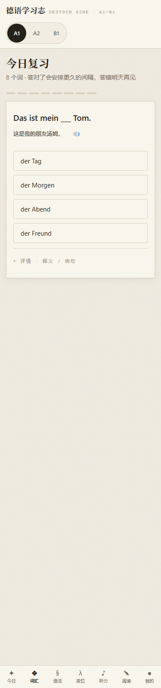
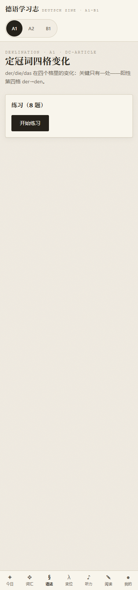
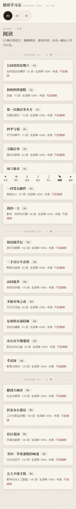
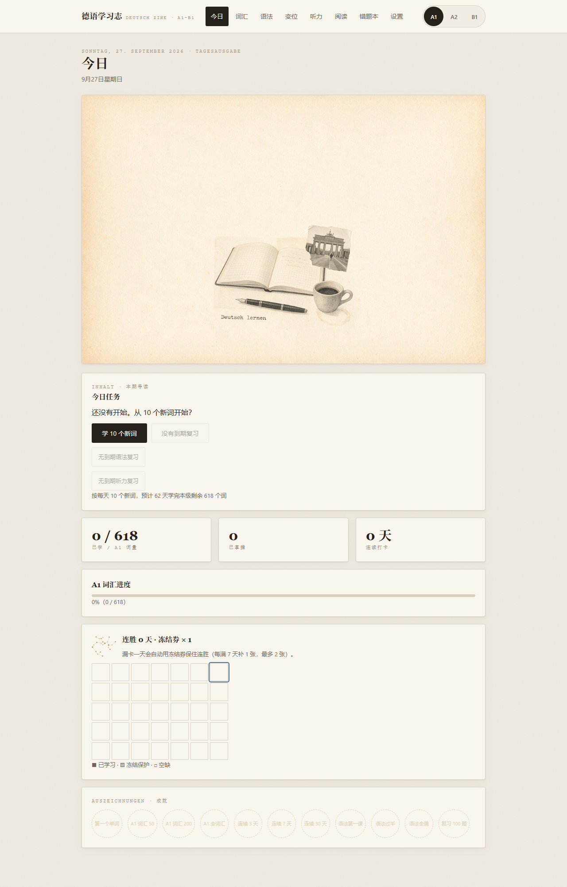
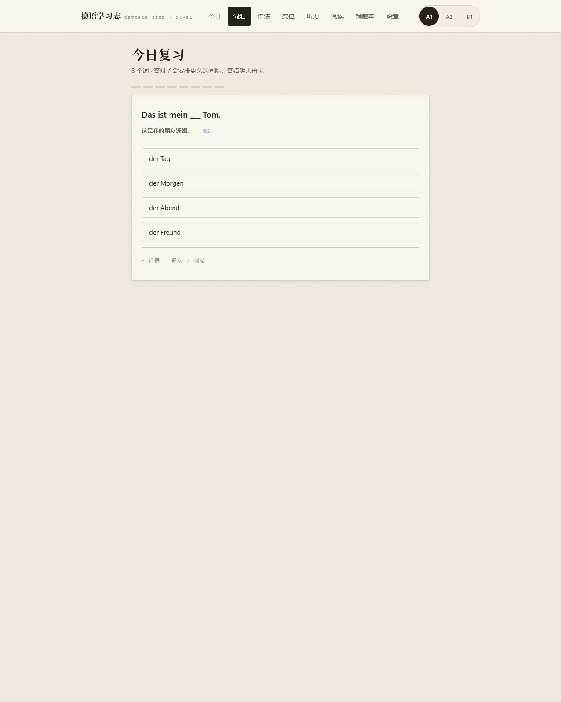
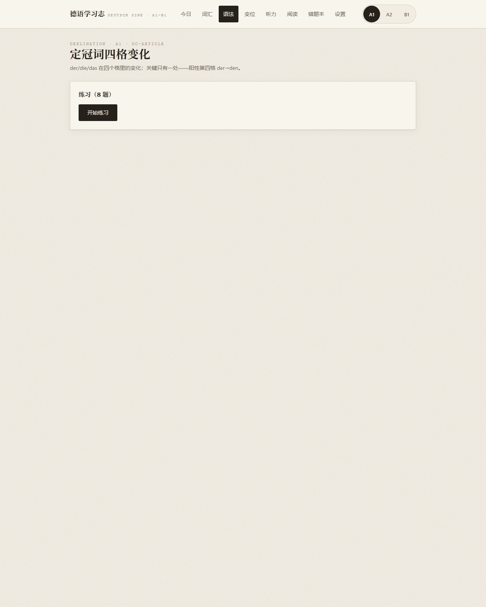
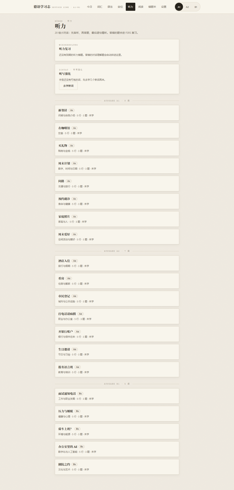
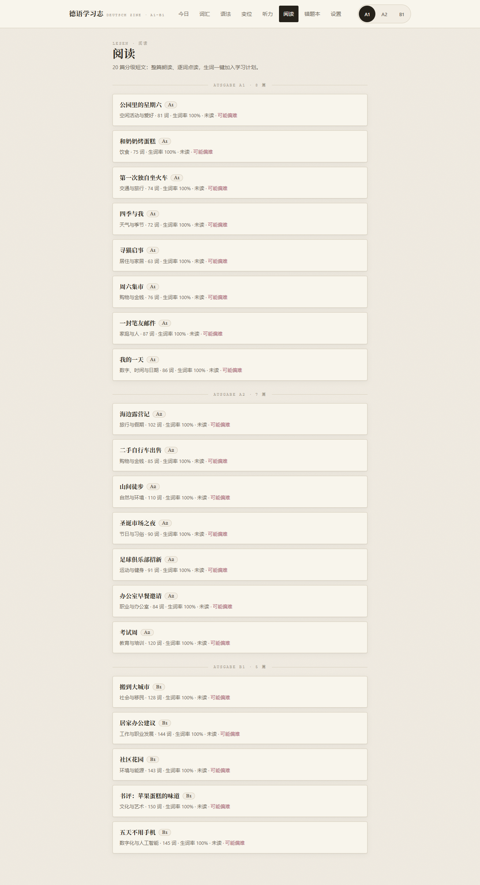

# 德语学习志 · Deutsch Zine

<p>
  
</p>

面向中文母语者的德语自学应用，覆盖 **A1 → B1**。**以手机端为主要使用场景**（iOS / HarmonyOS / Android 浏览器），桌面端同样可用。纯静态网页、零服务器、零账号——学习数据只存在你自己的浏览器里，不上传任何东西。

装到手机主屏幕后即可离线使用：**不需要应用商店，不需要注册，不需要联网**（首次安装后）。

## 为什么是「杂志」

语言学习需要的是一个愿意每天打开的环境。全站采用 muted zine 纸感设计：米色旧纸底、衬线刊头、打字机微文本、装饰金线——像翻一本德语小杂志，而不是刷一张表格。

## 学习系统（参考百词斩，并由遗忘曲线驱动）

- **图片四选一**：看图识词是核心题型，图文直接建立记忆钩子（833 张逐张视觉审核过的配图；无图词自动回退文字题）
- **语境填空**：把学过的词放回句子里挖空做四选一——句源全部来自既有内容（1945 条词条例句、100 行听力对话、20 篇阅读短文句），题干附中文与整句朗读；复习时约 25% 概率混入，有图词优先出图片题；阅读页与听力对话页底部另有「练一练」入口，判分写回目标词卡 SRS
- **三按钮分流**：介绍每个词时选「不认识 / 认识 / 斩」——认识的词进一次验证复习，答对即「斩」；斩掉的词永久移出复习
- **渐进式提示**：答得错得多，提示给得多——图片题：释义 → 排除至二选一 → 高亮答案；选择题：词性+首字母 → 揭示；拼写：首字母 → 半词 → 完整答案
- **错词反复出现**：答错的词当次隔 3 题再来，直到答对（每词上限 2 轮）
- **FSRS 遗忘曲线复习**：Anki 同款 FSRS-4.5 算法；复习队列按可提取度升序，最容易忘的优先；待验证卡与错词插队
- **单词详情抽屉**：任意词卡可展开释义、IPA 音标、例句（含朗读），动词附现在时六人称变位小表
- **真人发音 + 慢速朗读**：真人录音优先（Wikimedia Commons，逐词署名），合成语音兜底；词卡支持 0.5× 慢速播放
- **听力训练**：20 组小对话（A1×8 / A2×7 / B1×5）分角色音频，盲听整组 → 看题作答 → 逐句精听三步走；答错的题进 FSRS，到期重听再答
- **分级阅读**：20 篇短文（A1×8 / A2×7 / B1×5）逐词三态着色（已掌握/学习中/生词），点词看释义、发音与例句，词库词一键加入学习计划；篇内生词率实时统计，每篇配整篇朗读音频
- **听写强化**：用已学词汇做听音拼写训练，到期词优先、渐进提示照旧，评分写回词卡 SRS
- **变格词尾专项**：6 个专题 50 题（定冠词四格 / 不定与否定冠词 / 形容词词尾 / 人称代词三四格 / 弱变化名词 / 介词配格），专练冠词、代词、形容词、名词的词尾选择；答错的题按 `dc-` 卡 id 进语法复习队列，错题本单列「变格」分支，入口在语法页顶部（`#/declension`）
- **每日节奏**：「今日新词 x/N」进度可见，设置页 5–30 词可调，今日页显示预计学完天数

## 内容规模

| 维度 | 数量 |
|---|---|
| 词汇 | 1945 词（A1 618 / A2 612 / B1 715），38 个主题 |
| 语法 | 36 个专题（讲解 + 交互练习）+ 变格词尾专项 6 专题 50 题，错题纳入 FSRS |
| 听力 | 20 组小对话（A1×8 / A2×7 / B1×5，分角色音频 100 条，三步精听），另有听写强化训练 |
| 阅读 | 20 篇分级短文（A1×8 / A2×7 / B1×5，逐词三态着色 + 点词卡片 + 整篇朗读 20 条） |
| 音频 | 1945 词 + 1945 例句 + 251 变位形式 + 100 对话行 + 20 篇整篇朗读；真人发音（Wikimedia Commons）优先，edge-tts 神经语音兜底 |
| 图片 | 833 张词条配图（全部经视觉审核）+ 38 张 Seedream 生成的 zine 风主题封面 |
| 其他 | 动词变位查询、错题本、连胜日历、成就徽章、移动端底部导航、PWA 离线安装（图标 192/512/maskable-512） |

## 界面

> 以手机端为主场景（下列竖图为 375px 手机宽度实拍）。

<p>
  
  
  
  
</p>

<p>
  
  
</p>
<p>
  
  
</p>
<p>
  
  
</p>
<p>
  
  
</p>

## 装到手机上（推荐方式：不上应用商店 + 装完即离线）

**关键前提**：Service Worker（离线壳）只在**安全上下文**下注册——即 `https://` 或 `localhost`。用 `python -m http.server` 起服务、手机连同一个 WiFi 打开 `http://192.168.x.x:8765` **不算安全上下文**，离线壳不会注册，也就拿不到「装到主屏后断网可用」。所以手机端要走静态托管。

### 三步装好

1. **部署到静态托管**（任选其一，纯静态、无需构建步骤）
   - **GitHub Pages**（最省事，仓库已在此）：仓库 `Settings → Pages → Source: Deploy from a branch → main /(root)`，几分钟后得到 `https://<用户名>.github.io/deutsch-learnen/`
   - 其他任意静态托管（Netlify / Vercel / Cloudflare Pages / 自己的服务器）同理，把仓库根目录整个传上去即可
2. **手机浏览器打开那个 https 地址**
3. **添加到主屏幕**，然后从主屏图标启动——之后**完全离线可用**

### 各平台「添加到主屏幕」的入口

| 平台 | 浏览器 | 操作 |
| --- | --- | --- |
| **HarmonyOS** | 华为浏览器 | 打开页面 → 菜单 → 「添加至桌面」（官方叫「添加网站桌面快捷方式」，**有 10 个上限**） |
| **iOS** | Safari（必须用 Safari，微信/Chrome 内置浏览器不行） | 底部「分享」按钮 → 「添加到主屏幕」 |
| **Android** | Chrome / Edge | 地址栏右侧「安装」图标，或菜单 → 「安装应用」/「添加到主屏幕」 |
| **桌面** | Chrome / Edge | 地址栏右侧的「安装」图标 |

> **鸿蒙上不是沉浸式全屏**：华为官方只承诺「桌面快捷方式」，**没有**承诺隐藏浏览器地址栏与底栏；开发者实测也反馈鸿蒙 6 装到桌面后仍带浏览器 UI。所以本应用在鸿蒙上请按「带浏览器 UI 的视口」预期使用，底部导航在部分版本上可能被浏览器底栏挤压。

> **iOS 26 起**：任何网站添加到主屏后默认就以 Web App（独立窗口）打开，用户也可以手动关掉。若你的图标打开后仍带 Safari 地址栏，请在「设置 → Safari → 打开为 Web App」保持开启——这也关系到下面那条存储豁免。

> iOS 没有自动安装提示（不支持 `beforeinstallprompt`），只能走上面的手动入口；Android / 桌面 Chromium 系会自动提示。

### ⚠️ iOS 用户请注意：不装到主屏，学习记录可能被系统清除

这不是本应用的 bug，是 iOS/Safari 的策略：**在 Safari 里直接浏览的站点，7 天不访问会被清掉 Service Worker、缓存与 IndexedDB**。Apple 工程师在 [WebKit Bug 232302](https://bugs.webkit.org/show_bug.cgi?id=232302) 里明确回复「**在 Safari 里没有办法获得豁免**」，唯一的解法是**添加到主屏幕**、且应用清单使用 `standalone` 或 `fullscreen` 显示模式——本应用已经是 `display: standalone`，所以：

- **添加到主屏幕后从此处启动** → 学习记录受保护，断网也能用；
- **只在 Safari 标签页里用** → 设备 7 天不访问这个站点，**你的学习进度可能被系统清掉**。

> 补充两条实测事实：① 豁免条件是 `standalone` / `fullscreen` 独立窗口，**`minimal-ui` 不豁免**（本应用用前者，这条配置是数据安全防线，别改回去）；② **localStorage 镜像也在清除名单里**，所以它不能当备份用。容量不是问题（Safari 17+ 单 origin 配额可达磁盘 60%），风险 100% 来自驱逐。

### 设备自检页（换新手机 / 换浏览器时先跑一次）

部署后访问 **`device-check.html`**（例如 `https://<用户名>.github.io/deutsch-learnen/device-check.html`），它会逐项报告：Service Worker 能否注册（决定能不能离线）、是否已装为主屏应用、存储配额与持久化、音频两种播放方式（同步/异步）的结果、系统德语语音是否可用、安全区与视口。**排查问题请先跑它**。

### 为什么不用应用商店

纯 Web 应用不需要审核、不需要开发者账号、不需要签名，改完推上去手机刷新就是新版。代价是**没有推送通知**（本项目也不需要）。

### 桌面端与 `file://`

- **桌面双击 `index.html`** 也能用（数据、音频、图片、学习记录全部正常，实测 IndexedDB 与 localStorage 在 `file://` 下均可写入），但 `file://` 下 Service Worker 不注册，所以没有「安装」体验，**iOS 上也走不通这条路**（iOS 没有「拷文件夹再用浏览器打开」的通路）。
- 桌面端的本地服务：`python -m http.server 8765` 然后开 `http://localhost:8765`（`localhost` 算安全上下文，离线壳正常）。

## 开发

```bash
npm install         # 仅 esbuild 一个构建依赖
npm run dev         # watch 模式：src/ → js/bundle.js
npm test            # 102 项单元测试（FSRS 遗忘分支、判分、斩机制、图片选题、发音回退链、听力对话、阅读三态、语境填空、变格数据、词性题守卫、数据完整性）
npm run build       # 生产构建（IIFE + ES2018 + sourcemap + minify）
```

技术栈：原生 HTML/CSS/JS（ESM → esbuild 单文件 IIFE），Hash 路由，IndexedDB 主存 + localStorage 镜像。零框架、零运行时依赖。

```
data/     内容数据（按级别分文件懒加载；listening.js / reading.js / declension.js 为 index.html 静态加载）
src/      ESM 源码（构建入口 src/main.js）
audio/    预生成音频（word/sent/conj/dialog/reading 为 edge-tts；native/ 为 Wikimedia Commons 真人发音）
images/   配图与封面（credits.json 记录每张图的授权信息；icons/ 为 PWA 图标）
tools/    内容生产管道（音频/配图/封面/图标生成，详见 tools/README.md）
sw.js + manifest.webmanifest  PWA 离线壳（核心壳预缓存 + 媒体运行时 CacheFirst）
```

## 内容来源与授权

- **词条配图**：[Wikimedia Commons](https://commons.wikimedia.org/) 与 [Openverse](https://api.openverse.org/) 的免费授权图片（CC 系列/公有领域），逐张授权信息见 `images/credits.json`；全部经过逐张视觉相关性审核，错配图已移除
- **主题封面与装饰插画**：由 Seedream 5.0 pro 生成的 zine 纸感风格图
- **语音**：真人发音来自 [Wikimedia Commons](https://commons.wikimedia.org/) / Lingua Libre 贡献者（CC BY-SA/CC0），逐词署名见 `audio/credits_native.json`；合成兜底为 edge-tts 神经语音（个人学习用途；如二次分发请重新评估语音授权）
- **音标（IPA）**：[de.wiktionary.org](https://de.wiktionary.org/)（CC BY-SA），见 `data/ipa.js`
- **词汇/语法内容**：项目自编，参照 CEFR A1–B1 大纲

## 文档

| 文档 | 内容 |
|---|---|
| `DESIGN.md` | UI/UX 设计规范（muted zine 令牌、词性三色、动效底线） |
| `AGENTS.md` | 项目约定：目录结构、数据格式、命名约定、内容生产 SOP |
| `CHANGELOG.md` | 版本历史（Keep a Changelog） |
| `docs/技术调研与开发规划.md` | 竞品调研、架构演进、路线图 |
| `docs/superpowers/specs/`、`plans/` | S5–S9 各阶段的设计规格与实施计划（百词斩式学习系统 / zine 视觉改版 / 发音与 IPA / 听力模块 / 阅读模块 / 语境填空+变格专项+PWA） |
| `.tower/comms/` | 开发过程的评审记录与 findings（本地目录，不入版本库） |

## License

代码 MIT。内容资源（图片/音频）各随其源授权，见 `images/credits.json`；edge-tts 语音请在二次分发前自行评估。
